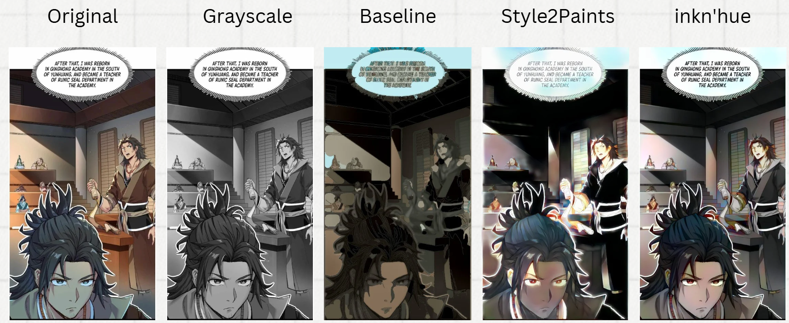
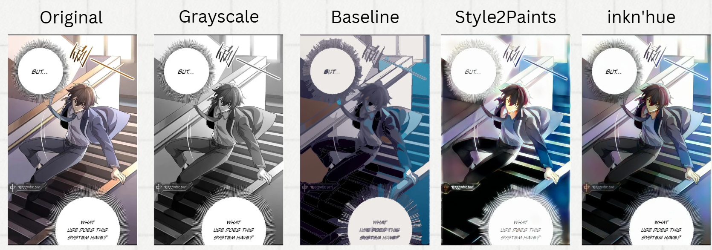

# comic-colorization

## Overview

此為灰階漫畫上色的方法。我們使用單一一張圖片訓練cGAN，灰階漫畫經過cGAN後對其做後處理，產生初始的上色圖片。萃取其顏色生成color hints，並丟入Style2Paints生成另一張初始上色圖，並放進inkn'hue裡面調整輸出的圖片顏色。我們的貢獻是優化使用一張圖片的方法並自動生成color hints以真正使模型自動化的為黑白漫畫上色。

## Baseline

### 檔案說明

* `CGAN colorization.ipynb` : 訓練cGAN和生成測試圖片的初始上色圖
* `Image Processing.ipynb` : 對cGAN生成的初始上色圖做後處理

### 環境設置

* python版本為3.11.10
* 在 `requirements_baseline.txt`中

### 模型參數設置

* cGAN的epoch是100次
* Segmentation使用的trapped ball大小參數有15, 10, 9, 8, 7, 6, 5, 4
* 增加20%Saturation
* Color Selection使用的方法是Kmeans，K為12

### 修改的repo來源

* [cGan-Based-Manga-Colorization-using-1-training-image](https://github.com/ryanliwag/cGan-Based-Manga-Colorization-using-1-training-image.git)

## Style2Paints V4.5

用於將我們生成的 Color hint image 繪製到無上色的線稿圖上。

### Setup

適合版本：CUDA 10.0, CuDNN 7, Python 3.6

``` shell
    pip install opencv-contrib-python
    pip install tensorflow
    pip install bottle
    pip install tqdm
```

從 [雲端](https://drive.google.com/drive/folders/1mM8RbNYM0AHu31U6UaEroGFT1hOHlY0V?usp=sharing) 下載 model 並放進 s2p_v45_server/nets 資料夾中，如：

``` shell
    s2p_v45_server/nets/inception.net
    s2p_v45_server/nets/refs.net
    ...
```

### Run

``` shell
    cd s2p_v45_server
    python Style2PaintsV45_source.py
```

### How to use

為了讓他可以自動輸入多張圖片並輸出，本來想要在 UI 上多設置一個可以執行這項任務的按鈕，但他的 UI 撰寫方式過於複雜，且其中還牽涉到了擁有千行且完全沒有整理過的 project.js，要更改實在過於困難，於是我們用了別的方式觸發這項任務。觸發方式如下：

1. 點擊右下角的上傳圖片按鈕
2. 隨意放入圖片檔
3. 點擊 OK 鍵觸發

輸入與輸出檔案位址：
可從 Style2PaintsV45_source.py 更改

輸入：
Input Image（可為黑白或彩色）

```python
folder_path = './append/Dataset'
```

Color Hint Image（要與對應的圖片檔名相同，且為 png 檔）

```python
color_hint_image_points = extract_color_blocks('./append/ColorHint/color_hint' + file_name + '.png')
```

輸出：
Rough Color Image（我們所要的上色結果）

```python
cv2_imwrite('./append/Result/' + file_name + '.jpg', blended_smoothed_careless)
```

Sketch Image（因 inkn'hue 對於圖片大小有強烈限制，因此可用於 inkn'hue）

```python
cv2_imwrite('./append/Sketch/' + file_name + '.jpg', sketch)
```

### 參考資料

https://github.com/lllyasviel/style2paints
https://dl.acm.org/doi/abs/10.1145/3272127.3275090?casa_token=WZyNCZJSU90AAAAA:5X3jcVgQFeOjiTWgr_qtfH9CjX-3l7UGWnyQ9WkAOyOI41h9q1oX3pdG3LiD0i99PnIARS3I_Rs

## inkn'hue

用於解決 Style2Paints 生成的 Rough Color Image 顏色過於飽和及部分溢色問題。

### Setup

1. 進入到資料夾

``` shell
cd inknhue-main
```

2. 設定環境

適合版本：Python 3.10、cudatoolkit >= 11.8

``` shell
conda env create -f environment.yaml
conda activate inknhue
```

3. 從 Hugging Face 下載 models

``` shell
rm -r models
git lfs install
git clone https://huggingface.co/rossiyareich/inknhue models
```

### Run

``` shell
python app.py
```

### How to use

為了讓他可以自動輸入多張圖片並輸出，我們在原本的第一個頁面的 UI 下方新增了 Run Dataset，直接點擊即可。但由於原本的部分函式回傳資料類型限制，難以實作這項功能，所以更改了回傳的資料，這也導致原功能無法正常運作，內容如下：

皆位於 app.py 中，將回傳值改為註解掉的內容即可恢復正常功能。

```python
def generate(sketch: Image.Image, s2p: Image.Image):
    ...
    # return gr.Image(result, interactive=True)
    return result
```

```python
def postprocess(gen: Image.Image, s2p: Image.Image, cratio):
    ...
    # return [ret, ret]
    return combined
```

輸入與輸出檔案位址：
可從 app.py 更改

輸入：
兩者對應的圖片檔名要相同
Sketch Image（Style2Paints 生成結果）

```python
folder1 = './append/Sketch'
```

Rough Color Image（Style2Paints 生成結果）

```python
folder2 = './append/Style2Paints'
```

輸出：
Color Image（我們所要的上色結果）

```python
exp_path = os.path.join('./append/Result', file1)
```

可調參數：
CIELAB Interpolation 所需的參數 λa∗b∗，用於調整 inkn'hue 通過 VAE 生成的圖片與 Style2Paints 生成的圖片的插值比例，數值範圍 0 ~ 1，越接近 0 越接近 VAE 生成的圖片；反之，越接近 1 越接近 Style2Paints 生成的圖片。
我們設定數值為 0.8。

```python
exp_img = postprocess(gen, img2, 0.8)
```

### 參考資料

https://github.com/memmaptensor/inknhue
https://arxiv.org/abs/2311.01804

## Evaluation Metric

在我們的研究中，為了全面評估模型的表現，我們選擇了 Fréchet Inception Distance (FID) 和峰值信噪比 (PSNR) 作為主要的量化評估指標。

### FID 指標的介紹

FID 用於衡量生成圖像的分佈與真實圖像的分佈之間的相似性，是一種基於 Wasserstein 距離的評估方法。FID 利用預訓練的 InceptionV3 模型，通過提取中間層激活值來建構生成圖像與真實圖像的多維高斯分佈，並計算兩者之間的距離。

### FID 的計算細節

- **數據分佈建構**：我們使用測試數據估算生成圖像與真實圖像的高斯分佈參數（均值和標準差矩陣）。
- **距離計算**：FID 的數學公式如下：

  ```
  FID = ||μ_r - μ_g||^2 + Tr(Σ_r + Σ_g - 2(Σ_rΣ_g)^{1/2})
  ```

  其中：  
  - μ_r 和 μ_g 分別為真實圖像和生成圖像分佈的均值。
  - Σ_r 和 Σ_g 分別為真實圖像和生成圖像分佈的協方差矩陣。

### PSNR 指標的介紹

PSNR 是一種用於衡量圖像質量的常見指標，特別是在壓縮和生成影像領域。PSNR 通常通過計算峰值信噪比來評估生成圖像與真實圖像之間的相似性。PSNR 的單位為分貝 (dB)，值越高代表生成圖像與真實圖像的相似度越高。

### 結論

綜合考量後，我們決定採用 FID跟PSNR 作為主要評估指標，通過該指標量化我們方法的改進效果，並輔助分析生成模型的性能。

### 參考資料

[https://wandb.ai/authors/One-Shot-3D-Photography/reports/-Frechet-Inception-Distance-FID-GANs---Vmlldzo0MzI0MjA](https://wandb.ai/authors/One-Shot-3D-Photography/reports/-Frechet-Inception-Distance-FID-GANs---Vmlldzo0MzI0MjA)

### How to Use

1. 把生成的圖片放在 `output` 資料夾。
2. 把真實圖片 (ground truth) 放在 `real` 資料夾。
3. 只要直接執行FID.py或PSNR.py就可以得到兩個分數了

## Results

* 第一組dataset其一測試圖片的原圖、灰階圖片、Baseline結果圖、Style2Paints結果圖、inkn'hue結果圖

* 第二組dataset其一測試圖片的原圖、灰階圖片、Baseline結果圖、Style2Paints結果圖、inkn'hue結果圖
