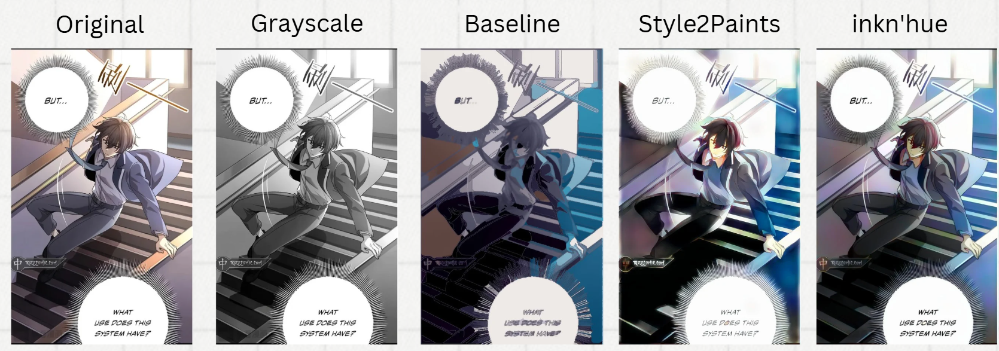

## Overview
此為灰階漫畫上色的方法。我們使用單一一張圖片訓練cGAN，灰階漫畫經過cGAN後對其做後處理，產生初始的上色圖片。萃取其顏色生成color hints，並丟入Style2Paints生成另一張初始上色圖，並放進inkn'hue裡面調整輸出的圖片顏色。我們的貢獻是優化使用一張圖片的方法並自動生成color hints以真正使模型自動化的為黑白漫畫上色。

## Baseline
### 檔案說明
* `CGAN colorization.ipynb` : 訓練cGAN和生成測試圖片的初始上色圖
* `Image Processing.ipynb` : 對cGAN生成的初始上色圖做後處理
### 環境設置
* python版本為3.11.10
* 在 `requirements_baseline.txt`中
### 模型參數設置
* cGAN的epoch是100次
* Segmentation使用的trapped ball大小參數有15, 10, 9, 8, 7, 6, 5, 4
* 增加20%Saturation
* Color Selection使用的方法是Kmeans，K為12
### 修改的repo來源
* [cGan-Based-Manga-Colorization-using-1-training-image](https://github.com/ryanliwag/cGan-Based-Manga-Colorization-using-1-training-image.git)

## Results
* 第一組dataset其一測試圖片的原圖、灰階圖片、Baseline結果圖、Style2Paints結果圖、inkn'hue結果圖

* 第二組dataset其一測試圖片的原圖、灰階圖片、Baseline結果圖、Style2Paints結果圖、inkn'hue結果圖
